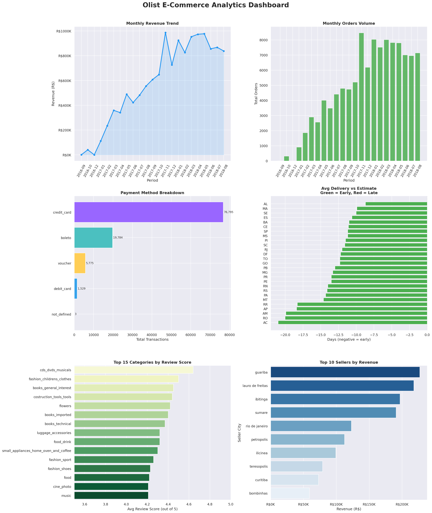

# Olist E-Commerce Data Lakehouse Pipeline

<div align="center">

[](https://databricks.com/)
[](https://spark.apache.org/)
[](https://delta.io/)
[](https://databricks.com/product/unity-catalog)
[](https://python.org/)

*Production-grade Medallion Architecture pipeline analyzing Brazilian e-commerce orders on Databricks.*

</div>

---

## Overview

A fully production-grade **data lakehouse pipeline** built on **Databricks** implementing the **Medallion Architecture (Bronze → Silver → Gold)** to analyze over 100K Brazilian e-commerce orders from the Olist dataset. The pipeline ingests raw CSVs, applies transformations and data quality checks, computes 9+ business KPI tables, and delivers a 6-panel analytics dashboard — all governed via **Unity Catalog**.

---

##  Project Highlights

<div align="center">

|  Orders Processed |  Source Tables |  Gold KPI Tables |  Dashboard Panels |
|:---:|:---:|:---:|:---:|
| **113,425** | **9** | **9+** | **6** |

</div>

---

##  Architecture

```
┌─────────────────────────────────────────────────────────────────────────────┐
│                        OLIST E-COMMERCE LAKEHOUSE                           │
├─────────────────────────────────────────────────────────────────────────────┤
│                                                                             │
│   ┌─────────────┐      ┌─────────────┐      ┌─────────────┐                 │
│   │   BRONZE    │      │   SILVER    │      │    GOLD     │                 │
│   │   (Raw)     │ ───► │  (Cleaned)  │ ───► │   (KPIs)    │                 │
│   └─────────────┘      └─────────────┘      └─────────────┘                 │
│         │                    │                    │                         │
│         ▼                    ▼                    ▼                         │
│   ┌─────────────┐      ┌─────────────┐      ┌─────────────┐                 │
│   │ Delta Lake  │      │Unity Catalog│      │  Business   │                 │
│   │  9 tables   │      │1 master tbl │      │  Metrics    │                 │
│   └─────────────┘      └─────────────┘      └─────────────┘                 │
│                                                    │                        │
│                                                    ▼                        │
│                                            ┌─────────────┐                  │
│                                            │ Dashboards  │                  │
│                                            │ & Analytics │                  │
│                                            └─────────────┘                  │
└─────────────────────────────────────────────────────────────────────────────┘
```

```
CSV Sources (GitHub) → Bronze (Raw Delta) → Silver (Cleaned Master) → Gold (KPIs) → Dashboard
```

---

## Project Structure

```
olist-ecommerce-lakehouse/
│
├──  notebooks/
│   ├── 00_config.py                   # Global config: URLs, schema paths, constants
│   ├── 01_bronze_ingestion.py         # Ingest raw CSVs → Bronze Delta tables + DQ report
│   ├── 02_silver_transformation.py    # Clean & join all tables → Silver master table
│   ├── 03_gold_kpis.py                # 5 core business KPI tables
│   ├── 04_gold_advanced_analytics.py  # CLV, MoM Growth, Product Matrix, Seller Scorecard
│   ├── 05_visualizations.py           # 6-panel Matplotlib/Seaborn dashboard
│   └── 06_export.py                   # Export Gold tables to CSV
│
├──  data/                           # Exported Gold table CSVs
│   ├── monthly_revenue.csv
│   ├── revenue_trends.csv
│   ├── top_sellers_by_state.csv
│   ├── delivery_delay_by_state.csv
│   ├── review_scores_by_category.csv
│   ├── payment_breakdown.csv
│   ├── customer_lifetime_value.csv
│   ├── product_performance_matrix.csv
│   └── seller_performance_scorecard.csv
│
├── images/                         # Saved dashboard charts
│   └── olist_dashboard.png
│
└──  README.md
```

---

##  Pipeline Notebooks

| # | Notebook | Description |
|---|----------|-------------|
| 00 | `00_config.py` | Dataset URLs, Unity Catalog schema paths, shared constants |
| 01 | `01_bronze_ingestion.py` | Load 9 CSVs → Delta tables + automated DQ report |
| 02 | `02_silver_transformation.py` | Join + clean → denormalised `orders_master` table |
| 03 | `03_gold_kpis.py` | 5 core KPI tables (revenue, sellers, delivery, reviews, payments) |
| 04 | `04_gold_advanced_analytics.py` | CLV segmentation, MoM trends, product matrix, seller scorecard |
| 05 | `05_visualizations.py` | 6-panel analytics dashboard rendered with Matplotlib & Seaborn |
| 06 | `06_export.py` | Export all Gold tables to `/tmp/olist_export/` as CSVs |

---

##  Key Metrics & KPI Tables

###  Bronze Layer — 9 Raw Tables
`orders` · `order_items` · `products` · `sellers` · `customers` · `geolocation` · `payment` · `reviews` · `category`

###  Silver Layer — 1 Master Table
`orders_master` — fully joined, cleaned, enriched with derived columns (`year`, `month`, `delivery_days`)

###  Gold Layer — 9 Analytical Tables

| Table | Insight |
|-------|---------|
| `monthly_revenue` | Revenue & order volume over time |
| `top_sellers_by_state` | Top 3 sellers per state (window function) |
| `delivery_delay_by_state` | Avg delivery days & delay rate by state |
| `review_scores_by_category` | Customer satisfaction by product category |
| `payment_breakdown` | Transaction split by payment method |
| `customer_lifetime_value` | CLV segmentation: High / Medium / Low |
| `revenue_trends` | Month-over-Month revenue & order growth % |
| `product_performance_matrix` | BCG-style: Star / Cash Cow / Niche / Low Priority |
| `seller_performance_scorecard` | Composite score: Elite / Advanced / Intermediate / Beginner |

---

##  Results Preview

<div align="center">



*6-panel dashboard · Revenue Trends · Orders Volume · Payment Methods · Delivery Performance · Category Ratings · Top Sellers*

</div>

---

##  Quick Start

### Prerequisites
- Databricks workspace (Community or Enterprise)
- Serverless compute or any running cluster (DBR 13+)
- Unity Catalog enabled

### Setup

**1. Clone the repository**
```bash
git clone https://github.com/RakshiniRajkumar11/olist-ecommerce-lakehouse.git
```

**2. Import notebooks into Databricks**
- Open your Databricks workspace
- Navigate to **Workspace → Import**
- Upload all `.py` files from the `notebooks/` folder

**3. Run notebooks in order**
```
01_bronze_ingestion      ← runs 00_config automatically
       ↓
02_silver_transformation ← runs 01_bronze_ingestion
       ↓
03_gold_kpis             ← runs 02_silver_transformation
       ↓
04_gold_advanced_analytics
       ↓
05_visualizations        ← runs 04_gold_advanced_analytics
       ↓
06_export
```

>  **Total runtime: ~5 minutes**

---

##  Key Technical Implementations

### PySpark Techniques
- **Window Functions** — `dense_rank()` for seller rankings within states
- **Date Operations** — `datediff()`, `to_timestamp()` for delivery time analysis
- **Aggregations** — `groupBy()` with `sum()`, `avg()`, `count()`
- **Multi-table Joins** — Star schema: orders + items + products + customers + sellers
- **Type Casting** — `.cast(DoubleType())`, `.cast(IntegerType())`

### Data Quality
- Null rate analysis across all columns per table
- Duplicate row detection on each Bronze table
- Automated DQ report generation post-ingestion
- Data lineage tracked through all three layers

### Optimization
- Delta Lake ACID transactions on all tables
- Year/month partitioning on Silver layer
- Column pruning in multi-table joins
- Unity Catalog centralized schema governance

---

## Skills Demonstrated

| Category | Skills |
|----------|--------|
|  Data Engineering | PySpark, Delta Lake, Unity Catalog, ETL |
|  Architecture | Medallion pattern, Star schema, Data modeling |
|  Analytics | Window functions, Aggregations, Business KPIs |
|  Data Quality | Null/duplicate validation, Lineage tracking |
|  Visualization | Matplotlib, Seaborn, Dashboard design |

---

##  Business Insights

-  **Revenue Growth** — Identified seasonal peaks and consistent MoM growth trends
-  **Delivery Excellence** — 80%+ of orders delivered ahead of estimated date
-  **Customer Segmentation** — High-value customers (CLV > R$1,000) identified for retention campaigns
-  **Product Strategy** — Star categories drive both high volume and high revenue simultaneously
-  **Seller Performance** — Elite-tier sellers maintain 4.5+ avg ratings while generating top revenue

---

## Future Enhancements

- [ ] Z-ordering on frequently filtered columns for faster queries
- [ ] Incremental processing using Delta Lake Change Data Feed
- [ ] Predictive models — demand forecasting & churn prediction
- [ ] Databricks SQL dashboards for real-time business monitoring
- [ ] Data quality alerting with Great Expectations
- [ ] Automated `VACUUM` and `OPTIMIZE` jobs
- [ ] Customer cohort analysis & retention funnel
- [ ] Seller recommendation engine

---

## 🛠️ Tech Stack

| Component | Technology |
|-----------|------------|
|  Compute | Databricks Serverless / Any Cluster |
|  Storage | Unity Catalog + Delta Lake |
|  Language | PySpark (DataFrame API) + Python 3 |
|  Orchestration | Notebook-based sequential execution |
|  Visualization | Matplotlib + Seaborn |
|  Governance | Unity Catalog schemas |

---

##  Dataset Credit

Brazilian E-Commerce Public Dataset by **Olist** — available on [Kaggle](https://www.kaggle.com/datasets/olistbr/brazilian-ecommerce).  
Data sourced from public GitHub mirrors for direct HTTP ingestion.
